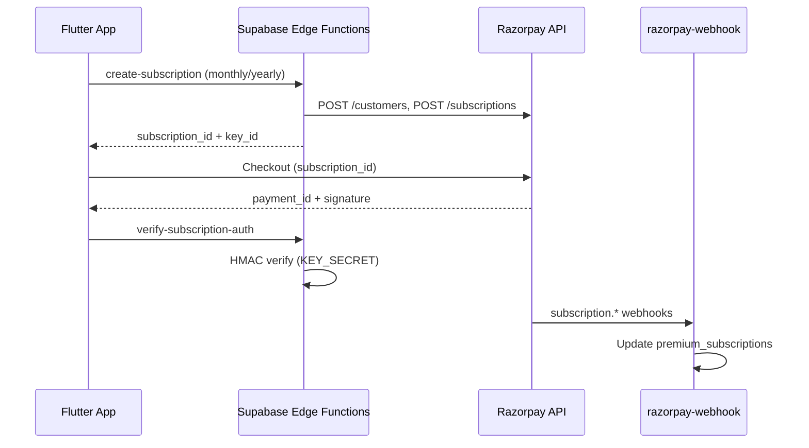

# Razorpay Production Integration Guide — Splitr (Android)

Data-backed guide for taking Splitr’s **existing** Razorpay integration from **Test mode** to **Live mode**. Scoped to what is implemented in this repo today.

**Official references (primary sources):**
- [Razorpay Quickstart](https://razorpay.com/docs/payments/quickstart/?preferred-country=IN)
- [API Keys (Dashboard)](https://razorpay.com/docs/payments/dashboard/account-settings/api-keys/)
- [Set up Razorpay Account / KYC](https://razorpay.com/docs/payments/set-up/?preferred-country=IN)
- [Flutter Standard Checkout](https://razorpay.com/docs/payments/payment-gateway/flutter-integration/standard/build-integration/)
- [Test Subscriptions](https://razorpay.com/docs/payments/subscriptions/test/)
- [Webhooks (Dashboard setup)](https://razorpay.com/docs/payments/dashboard/account-settings/webhooks/)
- [Subscription webhook events](https://razorpay.com/docs/webhooks/subscriptions/)

---

## Confirmed scope (from your answers + code review)

| Item | Value |
|------|--------|
| Razorpay account today | **Test mode only** (Live keys not available yet) |
| Business type | **Individual / freelancer** (unregistered) |
| Platform | **Android only** |
| Payment flows in app | **Donations** + **Splitr Pro subscriptions** |
| Group settle-up | **Not Razorpay** — UPI deep links (`manual_settle_up_screen.dart`) |
| Secrets hosting | **Prod Supabase** (`jgecopqgsvlglifyxofg`) + `env.prod.json` / GitHub secrets for app |
| Pro plan UI placeholders | **₹89/month**, **₹799/year** (`app_strings.dart` fallbacks) |
| Donations in prod | Document **current client-only flow** + **recommend server Orders + verification** |

---

## What Splitr uses Razorpay for (verified in code)

### 1. Donations (`DonateScreen`)

- Flutter opens Razorpay Standard Checkout with **amount + `RAZORPAY_KEY_ID` only**.
- **No** Razorpay Order created on server.
- **No** `payment_id` / signature verification on server.
- Success = client `EVENT_PAYMENT_SUCCESS` → thank-you toast.

**Files:** `lib/Screen/ProfileScreen/donate_screen.dart`, `lib/Services/razorpay_payment_service.dart`

### 2. Splitr Pro subscriptions

Server-authoritative flow:



**Edge Functions:**
| Function | JWT | Role |
|----------|-----|------|
| `create-subscription` | Yes | Create customer + subscription |
| `verify-subscription-auth` | Yes | Verify auth payment signature |
| `cancel-subscription` | Yes | Cancel at cycle end |
| `razorpay-webhook` | **No** | Webhook ingestion (signature verified) |

**Files:** `supabase/functions/create-subscription/`, `verify-subscription-auth/`, `cancel-subscription/`, `razorpay-webhook/`, `supabase/functions/_shared/razorpay.ts`

**Subscription billing params (hardcoded server-side):**
| Plan | `total_count` in API | Meaning |
|------|----------------------|---------|
| Monthly | `120` | Up to 120 billing cycles |
| Yearly | `10` | Up to 10 billing cycles |

Plan IDs come from Supabase secrets `RAZORPAY_PLAN_MONTHLY_ID` / `RAZORPAY_PLAN_YEARLY_ID` — **not** from the Flutter app.

---

## Secret inventory (do not mix Test vs Live)

| Secret | Where it lives | Client-safe? |
|--------|----------------|--------------|
| `RAZORPAY_KEY_ID` | App (`env.prod.json` → `AppSecrets.razorpayKeyId`) + Supabase EF | **Yes** (public key id) |
| `RAZORPAY_KEY_SECRET` | **Supabase Edge Functions only** | **Never** in app |
| `RAZORPAY_WEBHOOK_SECRET` | **Supabase Edge Functions only** | **Never** in app |
| `RAZORPAY_PLAN_MONTHLY_ID` | Supabase Edge Functions only | No |
| `RAZORPAY_PLAN_YEARLY_ID` | Supabase Edge Functions only | No |

**Key ID prefixes (Razorpay docs):**
- Test: `rzp_test_…`
- Live: `rzp_live_…`

Per [API Keys docs](https://razorpay.com/docs/payments/dashboard/account-settings/api-keys/): using Test keys in a production app shows success UI but **no real money is captured or settled**. You must swap **all** secrets to Live before accepting real payments.

---

## Phase A — Account activation (Individual, India)

You are on **Test mode only**. Live API key generation is blocked until KYC + website verification complete.

### A.1 Complete activation in Dashboard

1. Log in to [Razorpay Dashboard](https://dashboard.razorpay.com/).
2. Complete **Account Activation** / KYC ([set-up guide](https://razorpay.com/docs/payments/set-up/?preferred-country=IN)).

**Individual / unregistered path (official):**
- **CKYC fast path:** Personal PAN → mobile OTP linked to CKYC → documents auto-fetched → may skip Video KYC.
- **Fallback:** Document upload + Video KYC + Digilocker within 3 days ([FAQs](https://razorpay.com/docs/payments/faqs/?preferred-country=IN)).

**Typical documents (individual):** Personal PAN, Aadhaar, bank account for settlements ([activation support](https://razorpay.com/docs/payments/account-activation-support/?preferred-country=IN)).

**Timeline (official, not guaranteed):**
- CKYC: minutes if records exist.
- Manual + Video KYC: often **3–4 business days** review ([FAQs](https://razorpay.com/docs/payments/faqs/?preferred-country=IN)).
- Bank partner approval: additional working days.

You **can integrate and test in Test mode** while KYC is pending ([Quickstart](https://razorpay.com/docs/payments/quickstart/?preferred-country=IN)).

### A.2 Add website / app details (required for Live API keys)

Per [API Keys docs](https://razorpay.com/docs/payments/dashboard/account-settings/api-keys/):

1. Dashboard → **Account & Settings** → **Website and app settings**.
2. Submit website URL where payments are collected.
3. Razorpay verifies website — **up to ~3 working days**.
4. After verification, **Live mode → Generate Key** becomes available.

**For Splitr Android:** use a **public HTTPS** URL you control. App branding references `https://splitr.app` (`lib/Constants/app_branding.dart`). Use whatever URL is actually live with a privacy policy and product description — Play Store listing URL can supplement once published.

**Blocker if missing:** Live key generation disabled until website submitted and verified.

---

## Phase B — Dashboard: Test API keys

Use Test mode first (your current state).

### B.1 Generate Test API keys

1. Dashboard → toggle **Test Mode** (top).
2. **Account & Settings** → **API Keys** (under Website and app settings).
3. **Generate Key**.
4. Copy **`key_id`** + **`key_secret`** immediately — secret shown **once** ([API Keys docs](https://razorpay.com/docs/payments/dashboard/account-settings/api-keys/)).

**Access:** Owner or Admin role only.

### B.2 Store Test keys

| Location | Keys |
|----------|------|
| Supabase → Project Settings → Edge Functions → Secrets | `RAZORPAY_KEY_ID`, `RAZORPAY_KEY_SECRET`, `RAZORPAY_WEBHOOK_SECRET`, plan IDs |
| Local `env.prod.json` (gitignored) / CI `PROD_ENV_JSON` | `RAZORPAY_KEY_ID` **only** |

**Never** put `RAZORPAY_KEY_SECRET` in `env.prod.json` or GitHub `PROD_ENV_JSON`.

---

## Phase C — Dashboard: Subscription plans (Splitr Pro)

Create plans in **Test mode** first. Recreate in **Live mode** before go-live (plan IDs differ per mode).

### C.1 Create monthly plan

1. Dashboard (Test mode) → **Subscriptions** → **Plans** → **Create Plan**.
2. Suggested values (align with UI placeholders — **you must pick final INR amounts**):

| Field | Suggested value |
|-------|-----------------|
| Name | `splitr_pro_monthly` (matches `AppBranding.proPlanMonthlyLabel`) |
| Amount | **₹89** (8900 paise) — placeholder |
| Billing period | Every **1 month** |
| Currency | INR |

3. Save → copy **`plan_xxxxxxxx`** → Supabase secret `RAZORPAY_PLAN_MONTHLY_ID`.

### C.2 Create yearly plan

| Field | Suggested value |
|-------|-----------------|
| Name | `splitr_pro_yearly` |
| Amount | **₹799** (79900 paise) — placeholder |
| Billing period | Every **1 year** |
| Currency | INR |

→ Supabase secret `RAZORPAY_PLAN_YEARLY_ID`.

**Important:** Razorpay plan amount must match what users expect from the Premium screen. If you change UI prices later, create **new** plans (or update per Razorpay dashboard rules) and update secrets.

---

## Phase D — Dashboard: Webhooks (Test + Live separately)

Webhook URL for this project:

```text
https://jgecopqgsvlglifyxofg.supabase.co/functions/v1/razorpay-webhook
```

(`supabase/config.toml` project_id + standard functions path)

### D.1 Create Test webhook

1. Dashboard (**Test mode**) → **Account & Settings** → **Webhooks**.
2. **+ Add New Webhook**.
3. **URL:** URL above (must be public HTTPS; localhost rejected per [webhooks docs](https://razorpay.com/docs/payments/dashboard/account-settings/webhooks/)).
4. **Secret:** generate a long random string → Supabase `RAZORPAY_WEBHOOK_SECRET`.
   - Webhook secret **≠** API key secret (explicit in Razorpay docs).
5. **Alert email:** your ops email.
6. **Active events** — minimum set for current handler (`razorpay-webhook/index.ts`):

| Event | Why |
|-------|-----|
| `subscription.authenticated` | Auth payment completed |
| `subscription.activated` | Subscription active |
| `subscription.charged` | Recurring charge success |
| `subscription.pending` | Charge retry state |
| `subscription.halted` | Retries exhausted |
| `subscription.cancelled` | User cancelled |
| `subscription.completed` | All cycles done |

Optional for donations (if you add Orders later): `payment.authorized`, `payment.captured`, `payment.failed`, `order.paid`.

7. **Create Webhook**.

### D.2 Live webhook

Repeat **D.1** in **Live mode** with:
- Same URL (or separate Supabase project if you split environments — you chose single prod).
- **New** webhook secret → update Supabase `RAZORPAY_WEBHOOK_SECRET` when switching to Live.

**Operational rules ([webhooks docs](https://razorpay.com/docs/payments/dashboard/account-settings/webhooks/)):**
- Must return **2xx within 5 seconds** or Razorpay retries (exponential backoff, 24h) then **disables** webhook.
- URL cannot contain `razorpay` as domain.
- Up to 30 webhook URLs per account.

**Code behavior:** verifies `X-Razorpay-Signature` with `RAZORPAY_WEBHOOK_SECRET`; dedupes via `webhook_events` table.

---

## Phase E — App & Supabase configuration

### E.1 Flutter app (`env.prod.json`)

```json
{
  "RAZORPAY_KEY_ID": "rzp_test_xxxxxxxx"
}
```

Loaded via `--dart-define-from-file=env.prod.json` in release builds (`lib/config/app_secrets.dart`).

`RazorpayPaymentService.isConfigured` requires:
- Non-empty `RAZORPAY_KEY_ID`
- Platform Android or iOS (you ship Android only)
- Not web

### E.2 Supabase Edge Function secrets (complete list)

Set in **Supabase Dashboard → Edge Functions → Secrets** (or CLI):

```text
RAZORPAY_KEY_ID=rzp_test_xxxx
RAZORPAY_KEY_SECRET=xxxx
RAZORPAY_WEBHOOK_SECRET=your_webhook_secret
RAZORPAY_PLAN_MONTHLY_ID=plan_xxxx
RAZORPAY_PLAN_YEARLY_ID=plan_xxxx
```

Also required by functions (unchanged): `SUPABASE_URL`, `SUPABASE_SERVICE_ROLE_KEY`, `SUPABASE_ANON_KEY`.

Redeploy functions after secret changes:

```bash
supabase functions deploy create-subscription verify-subscription-auth cancel-subscription razorpay-webhook
```

### E.3 Android release build

- Package: `money.splitr.app`
- Plugin: `razorpay_flutter: ^1.4.5` (`pubspec.yaml`)
- `minSdk`: Flutter default (Razorpay requires ≥ 19 per [Android integration docs](https://razorpay.com/docs/payments/payment-gateway/android-integration/standard/go-live-checklist/))
- ProGuard: `minifyEnabled` not enabled today; if you enable R8 later, add Razorpay keep rules from [Flutter integration docs](https://razorpay.com/docs/payments/payment-gateway/flutter-integration/standard/build-integration/)

---

## Phase F — Test mode end-to-end checklist

Complete in **Test mode** before touching Live keys.

### F.1 Splitr Pro subscription

1. Set all Test secrets (Phase B–E).
2. Deploy edge functions.
3. Configure Test webhook (Phase D).
4. App build with Test `RAZORPAY_KEY_ID`.
5. In app: Premium → choose monthly or yearly → complete checkout.
6. Use Razorpay [test card / UPI flows](https://razorpay.com/docs/payments/subscriptions/test/).
7. Verify:
   - [ ] `create-subscription` returns `subscription_id`
   - [ ] Checkout opens with `subscription_id` (no manual amount — Razorpay docs)
   - [ ] `verify-subscription-auth` returns 200
   - [ ] `premium_subscriptions` row updates in Supabase
   - [ ] Webhook events appear in Dashboard → Webhooks → logs
   - [ ] Premium features unlock after poll (`_pollPremiumActivation`)

**Test subsequent charge (optional):** Dashboard → Subscriptions → select sub → **Charge this now** ([test subscriptions doc](https://razorpay.com/docs/payments/subscriptions/test/)).

### F.2 Donations (current behavior)

1. Donate screen → preset or custom amount (min ₹1).
2. Complete Test checkout.
3. Observe: thank-you toast on client success only.

**Known gap:** no server record of donation. See Phase H.

### F.3 Cancel flow

1. Active Test subscription → cancel in app.
2. Verify `cancel-subscription` edge function called.
3. Webhook `subscription.cancelled` updates status.

---

## Phase G — Go Live (Live mode)

Only after:
- [ ] KYC approved, Live mode enabled
- [ ] Website verified in Dashboard
- [ ] Live API keys generated
- [ ] Live subscription plans created (new `plan_` IDs)
- [ ] Live webhook configured
- [ ] Test flows pass in Test mode

### G.1 Swap secrets (all at once)

| Secret | Test → Live |
|--------|-------------|
| `RAZORPAY_KEY_ID` | `rzp_live_…` in Supabase **and** `env.prod.json` / `PROD_ENV_JSON` |
| `RAZORPAY_KEY_SECRET` | Live secret in Supabase only |
| `RAZORPAY_WEBHOOK_SECRET` | Live webhook secret |
| `RAZORPAY_PLAN_MONTHLY_ID` | Live plan ID |
| `RAZORPAY_PLAN_YEARLY_ID` | Live plan ID |

Redeploy edge functions. Ship new app build with Live `RAZORPAY_KEY_ID` via Play internal/beta first.

### G.2 Post-live verification

- [ ] Real ₹1 Pro auth charge (or minimum plan charge) on internal track
- [ ] Settlement bank account receives payouts per Razorpay settlement cycle
- [ ] Webhook delivery 2xx in Live mode logs
- [ ] Cancel + renewal tested with real instrument you control

### G.3 Play Store / compliance (outside Razorpay, but blocks real users)

- Privacy policy must disclose payment processing (Razorpay) and data shared.
- Play **subscriptions** policy: if you bill through Razorpay outside Google Play Billing, confirm your app category and digital goods policy — **this is a Google policy question**, not Razorpay. Splitr Pro is implemented via Razorpay Subscriptions, not Play Billing. Validate against [Google Play payments policy](https://support.google.com/googleplay/android-developer/answer/9858738) for your feature set before production rollout.

---

## Phase H — Donations: production recommendation

**Current state:** client-only checkout — **not** production-grade for accounting, disputes, or fraud.

**Recommended pattern (Razorpay standard — not implemented yet):**

1. **Server:** `POST /v1/orders` with amount in paise (new Supabase edge function).
2. **App:** pass `order_id` to checkout options (in addition to `key`).
3. **Server:** on success, verify `razorpay_payment_id` + `razorpay_order_id` + `razorpay_signature` using `KEY_SECRET`.
4. **Webhook:** subscribe to `payment.captured` / `order.paid` as backup ([webhooks overview](https://razorpay.com/docs/webhooks/)).

Until implemented: treat donations as **best-effort tips**, not audited revenue.

---

## Troubleshooting

| Symptom | Likely cause | Fix |
|---------|--------------|-----|
| `Razorpay is not configured` in app | Empty `RAZORPAY_KEY_ID` in build | Set in `env.prod.json` / `PROD_ENV_JSON` |
| Checkout opens then fails immediately | Test key in Live mode or vice versa | Match key prefix to Dashboard mode |
| `Invalid webhook signature` | Wrong `RAZORPAY_WEBHOOK_SECRET` or Test/Live mismatch | Regenerate webhook secret; update Supabase |
| Pro stuck on pending | Webhook not firing or 5xx from function | Check Supabase function logs; webhook 2xx |
| `Missing env: RAZORPAY_PLAN_*` | Plan secrets not set | Create plans; set Supabase secrets |
| Live keys option missing | KYC or website not verified | Complete Phase A |
| Donation “success” but no Dashboard payment | Test keys in prod build confusion | Verify Dashboard mode + key ID |
| Premium active in app but not server | Webhook lag | Wait for `subscription.activated`; check `_pollPremiumActivation` timeout |

---

## Open items (need your input before finalizing amounts / URLs)

These were **not** assumed in this doc:

1. **Final Pro pricing** — placeholders ₹89 / ₹799 used; confirm before creating Live plans.
2. **Public website URL** for Razorpay verification — confirm `https://splitr.app` is live with privacy policy.
3. **Google Play billing policy** sign-off for Pro outside Play Billing.
4. **Donation Orders API** — implement before treating donations as production revenue?

---

## Quick reference — file map

| Area | Path |
|------|------|
| Checkout service | `lib/Services/razorpay_payment_service.dart` |
| Premium controller | `lib/Controllers/premium_subscription_controller.dart` |
| Donations UI | `lib/Screen/ProfileScreen/donate_screen.dart` |
| App key (client) | `lib/config/app_secrets.dart` |
| Razorpay API helper | `supabase/functions/_shared/razorpay.ts` |
| Webhook handler | `supabase/functions/razorpay-webhook/index.ts` |
| DB schema | `supabase/migrations/20260712130000_razorpay_premium_subscriptions.sql` |
| Env template | `env.example.json` |

---

*Last aligned with repo + Razorpay docs: July 2026. Re-verify Dashboard UI labels if Razorpay updates their console.*
